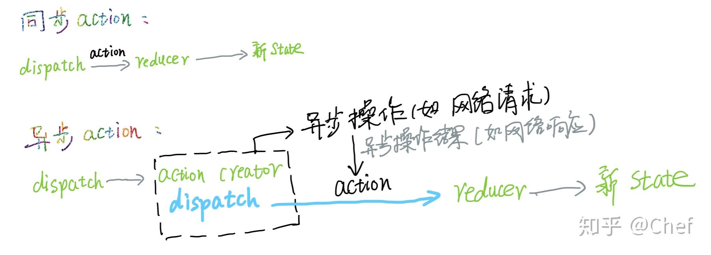
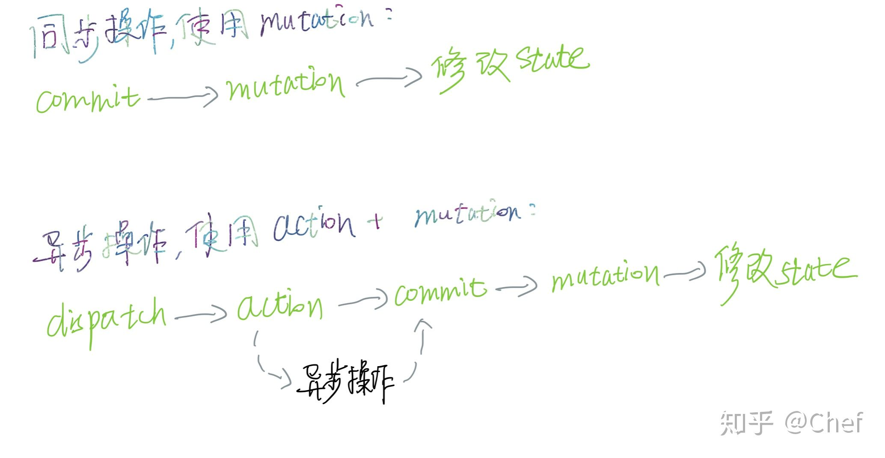

vuex和redux的作用十分相似，但是vuex使用在vue中，redux一般结合react使用，微信小程序开发时也可以结合使用！所以了解vuex和redux的用法以及他们之间的区别也是面试官的常考题

## Redux
- 整个应用只有一个Store：单一数据源
- Store.state不能直接修改（只读），必须调用dispatch(action) => store.reducer => return newState
- Action是一个对象，且必须具有type属性，用来告诉reducer执行哪个操作
- reducer必须是一个纯函数，以此来保证相同的输入必定是相同的输出，确保返回的- - newState可预测可控
  
大型应用中可以有多个reducer，通过combineReducer 来整合成一个根reducer

Redux的大概流程：
```
// view中发出 Action
store.dispatch(action)
// store 自动调用reducer，传入当前state和action
let newState = xxxReducer(currentState, action)
// state发生变化，store自动调用监听函数
store.subsrcibe(listener)
// listener可以通过 store.getState() 得到当前状态。如果使用的是 React，这时可以触发重新渲染 View
function listerner() {
  let newState = store.getState();
  component.setState(newState);   
}
```


## Vuex
- 由 State + Muatations(commit) + Actions(dispatch) 组成
- 全局只有一个Store实例（单一数据源）
- Mutations必须是同步事务，Why?：不同步修改的话，会很难调试，不知道改变什么时候发生，也很难确定先后顺序，A、B两个 mutation，调用顺序可能是 A -> B，但是最终改变 State 的结果可能是 B -> A
- Actions 负责处理异步事务，然后在异步回调中触发一个或多个mutations，当然，也可以在业务代码中处理异步事务，然后在回调中同样操作
- 模块化通过module方式来处理，这个跟Redux-combineReducer类似，在应用中可以通过namespaceHelper来简化使用


## 对比Redux
- Redux： 
```
// view——>actions——>reducer——>state变化——>view变化（同步异步一样）
```
- Vuex：
``` 
// view——>commit——>mutations——>state变化——>view变化（同步操作） 
// view——>dispatch——>actions——>mutations——>state变化——>view变化（异步操作）
```
总的来说都是让 View 通过某种方式触发 Store 的事件（mutation）或方法（reducer），Store 的事件或方法对 State 进行修改（state.xxx = xxx）或返回一个新的 State（return newState），State 改变之后，View 发生响应式改变（setState vs 数据劫持响应式）。

--- 
以上内容参考资料
作者：白手_
链接：https://www.jianshu.com/p/79669843372f
来源：简书

## 以下是补充介绍

同样是状态管理库，Vuex 跟 Redux 差不多，几乎与 Redux 的理念一模一样。个人感觉 Vuex 使用起来要比 Redux 简单好懂，也许是因为学了 Redux 理解 Vuex 就简单了。下面来简单对比一下两者，对比可以帮助我们更好的学会使用他们, 没有代码。
### 1. 核心概念对比
#### Redux 的核心概念
- action （同步action ，或借助 中间件 实现异步操作，action 不会改变 store，只是描述了怎么改变store）| mutation（用于同步操作） 、action（可用于异步操作，提交 mutation）
- reducer（纯函数，根据 action 和旧的 store 计算出新的 store
- store（单一数据源）
  
### Vuex 的核心概念
- mutation（用于同步操作） 、action（可用于异步操作，提交 mutation）
- mutation里面直接修改 state
- state（单一数据源）

### 其他：
- i） Redux 提供了 store.getState() 这个 API 获取 store 树，还有 store.subscribe(listener) 订阅 store 的变化，当 store 改变时会调用监听器；Vuex 有一个 getter 的概念用于根据 state 派生出一些数据，像 Vue 的计算属性一样，当 state 改变时会重新计算出一个结果出来，提供给需要的组件。

- ii） 对于大型项目，当应用状态数据过于复杂，可以划分状态，这样便于管理数据流向。Redux 可以通过 combineReducers（）结合各个组件的 reducer，各个组件可以单独管理自己的状态，最后合并为一个 reducer 用于生成一个 store；Vuex 这方面用 Module 这个概念划分 store，与 Redux 一样，可以多层嵌套子状态。

- iii） 将状态数据绑定到视图：Redux 将状态映射到视图可以通过 React-redux 映射到 React 组件， 当然也可以直接使用 Redux 自己提供的 store.subscribe() 订阅 store 的改变，从而更新视图，因此 Redux 不仅仅可以用于 React，也可以用于其他框架如 Vue；而 Vuex 只能用于 Vue，它提供了 mapState、mapAction、mapMutations 等API 将 store 映射到 Vuex 各个组件，这个参考了 React-redux 的 mapStateToProps。

### 2. 使用原则：
#### Redux 的三大原则：
- （1）单一数据源（一个Redux应用只有一个store），也是单向的数据流；
- （2）state只读（唯一改变 state 的方法就是触发 action，action 是一个用于描述已发生事件的普通对象。）；
- （3）使用纯函数（reducer）来修改state。
#### Vuex 的三大原则：
- a. 应用层级的状态应该集中到单个 store 对象中。
- b. 提交 mutation 是更改状态的唯一方法，并且这个过程是同步的。
- c. 异步逻辑都应该封装到 action 里面。
### 3. 处理异步操作
Redux 得益于 中间件机制，利用 redux-thunk （redux-thunk 可以 dispatch 函数，这个函数用于生成 action，所以在这个函数里面我们可以进行异步操作，等异步的结果出来后再放在 action 里面将这个 action 用 dispatch 分发出去, 而这个函数被叫做 “action creator” ），可以将异步逻辑放在 action creator 里面，通过 action creator 做一个控制反转， 给 action creator 传入 dispatch 作为参数，于是就可以 dispatch action，（原本是通过 dispatch 来分发 action ,现在是异步 action 即 action creator 掌握了控制权调用 dispatch，所以叫控制反转），Redux 并没有创造单独的概念出来专门用于异步逻辑，它是利用了 Redux 自己实现的中间件机制，中间件从 dispatch 一个异步 action 到 action 到达 reducer 之间处理 action，在这期间通过异步操作得到的结果可以放到 action 里面再通过 dispatch 分发到 reducer，以前 dispatch 一个 action 之后，这个 action 回立即到达 reducer ，所以是同步 action，现在在 action creator 里面，我们通过控制反转，可以等待异步操作结果再生成 action 分发，所以叫做异步 action：




而 Vuex 是用 mutation 来对应 Redux 的 action，另外 Vuex 又创造了一个 action 来提交 mutation 并通过异步提交 mutation 来实现异步操作结果能够到达 state.



