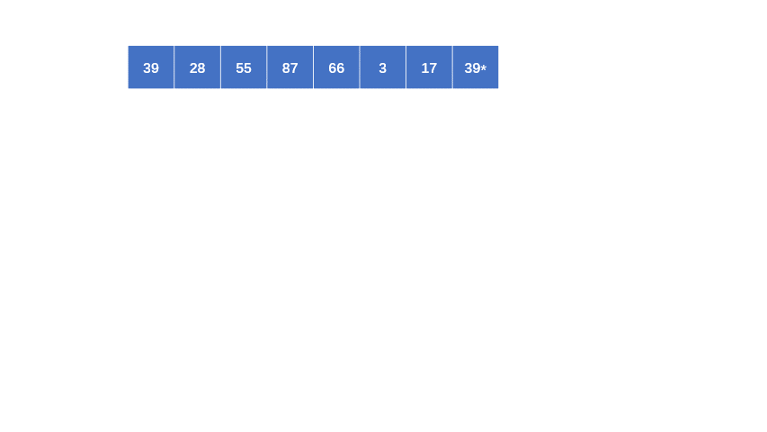
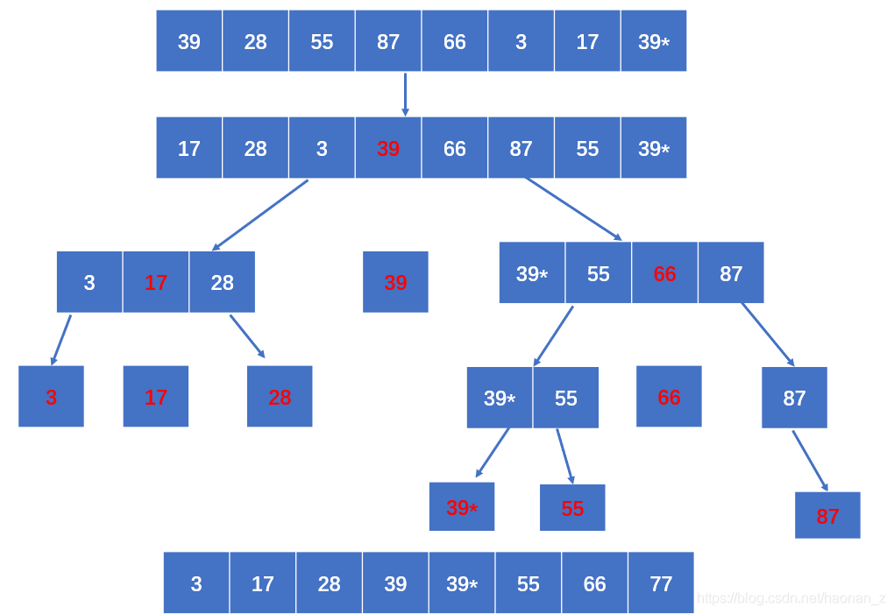

这段时间公司动荡可能要换工作，做梦都在想着敲代码和面试题，昨天晚上睡觉的时候梦到自己面试被问到排序题，今天早上起来第一想法就是把几种排序方式记下来：（作为过来人的经验，换工作前一定要多刷面试题，不然很吃亏），话不多说，我们开始介绍吧！

为了方便用来测试，我们使用同一个数组进行排序，我们可以来一个随机数组
```
const arr = []
const arrLength = 11 //可以随机长度 Math.floor(Math.random() * 30) + 1
for (let i = 0; i < arrLength; i++) {
    arr.push(Math.floor(Math.random() * 99) + 1)
}
console.log(arr, 'arr')
```
## 1.冒泡排序
先上图（图是从别人的文章拿的）

 
这个比较简单，看图敲代码就行了
```
//冒泡
function bubbleSort(arr){
    const len = arr.length
    for(let i=0;i<len;i++){
        for(let j=0;j<len-i;j++){
            if(arr[j+1]<arr[j]){
                const tem = arr[j+1]
                arr[j+1] = arr[j]
                arr[j] = tem
            }
        }
    }
    return arr
}
console.log(bubbleSort(arr),'bubbleSort arr')
```
无非就是一次循环中，比较相邻两个元素的值大小，大的排后面，小的放前面，直到一次循环结束，最大的值（有可能多个一样大）就排最后
接着下一次循环（此时已排序的元素就不再参与了），直到结束，所以用两个for循环就解决了

## 2.选择排序
依旧是先上图
 

选择排序的重点是一次循环对比找出其中的最值（这里默认最小值），然后在这次循环结束后，把最小值和数组第一项的值互换位置，然后接着下一次循环（注意一样是已排序的不再参与，后面的排序算法也是如此），这样每次循环后，最小值都会排到前面去

上代码
```
// 选择
function selectionSort(arr){
    const len = arr.length
    for(let i=0;i<len;i++){
        let min = i
        for(let j=i+1;j<len;j++){
            if(arr[j]<arr[min]){
                min = j
            }
        }
        const tem = arr[i]
        arr[i] = arr[min]
        arr[min] = tem
    }
    return arr
}
console.log(selectionSort(arr),'selectionSort arr')
```
## 3.插入排序
看图
 

由图可见，其实就是每次循环，拿后面的元素值与前面已经排完顺序的元素进行比较，小于前一个元素就进行位置互换，再接着比较前一个，不小于就结束此次循环，这样每次循环后，已排序的元素就会是从小到大的顺序，直到所有的元素都参与过排序
```
//插入
function insertionSort(arr){
    const len = arr.length
    for(let i=1;i<len;i++){
        for(let j=0;j<i;j++){
            if(arr[i]<arr[j]){
                const tem = arr[i]
                arr[i] = arr[j]
                arr[j] = tem
            }
        }
    }
    return arr
}
console.log(insertionSort(arr),'insertionSort arr')
```
## 4.快速排序
来到快排了，面试中最常见面的排序之一，这个排序比前面的要复杂些，先简单说一次思路
 
快排主要的思想是分治法，从数组中取出一个元素的值（默认我们取第一个元素）当基准（分界值），把数组中比基准值小的放左边，比基准值大的放右边，这样形成左边一个数组，右边一个数组

接着，我们按照上面的方式继续分治左右的这两个数组，直到左右两边的元素没法再分

下面我们来看图，看看如何比较基准来分成两组的
 

上面的图是快排的第一轮排序，简单分析一下：

定第一项的值39为基准，并空出位置（为了更形象）
先从右边开始比较大小，不小于39的略过，比较从右往左的下一个，小于39的时候，则把值赋予空位，并记录下此时的位置为right
接着从左边开始比较，不大于39的略过，比较从左往右的下一个，大于39的时候，则把值赋予空位，并记录下此时的位置为left
再接着从右边开始上面的操作，直到left和right相遇（即left不小于right了），到此，把数组分成了以基准（39）为分界线的两个数组了
然后我们再进行新一轮的基准定义，重复以上操作，直到分无可分

从上图可以看出，这个个过程是一个树状图的结构，一旦涉及树状图，那我们的函数思想就是递归了（不了解递归的自行百度）

上代码：
```
function quickSort(arr) {
	//定义一个递归函数
    const recursion = (arr, left = 0, right = arr.length - 1) => {
        if (left < right) { //过程5：此时left===right,分无可分，则代表整个递归循环着结束
            let i = left, j = right, pivot = arr[i];
            while (i < j) { //过程4：i与j相遇则结束此次递归循环，此时i===j

				//i++和j--是参与完逻辑运算后才自增，不太熟悉的同学可以去看看i++和++i的区别
                while (i < j && arr[j] > pivot) j--
                if (i < j) arr[i++] = arr[j]  //这里用i++，被换过来的必然比x小，赋值后直接让i自加，不用再比较，可以提高效率，下同
                while (i < j && arr[i] < pivot) i++
                if (i < j) arr[j--] = arr[i]
            }
            arr[i] = pivot
            recursion(arr, left, i - 1) //继续左边数组的分治
            recursion(arr, i + 1, right) //继续右边数组的分治
        }
    }
    recursion(arr)
    return arr
}
console.log(quickSort(arr), 'quickSort arr')
```

## 总结
排序速度方式对比：
```
冒泡排序：bubleSort: 6846.92724609375ms
快速排序：quickSort: 342.636962890625ms
选择排序：pickSort: 5732.3818359375ms
插入排序：spliceSort: 859.482177734375ms
希尔排序：shellSort: 58.785888671875ms
Array.prototype.sort: 69.878173828125ms
```
希尔排序 > Array.prototype.sort > 快速排序 > 插入排序 > 选择排序 > 冒泡排序


---
参考资料：
CSDN博主「Henry_楠」的原创文章
原文链接：https://blog.csdn.net/haonan_z/article/details/118633331